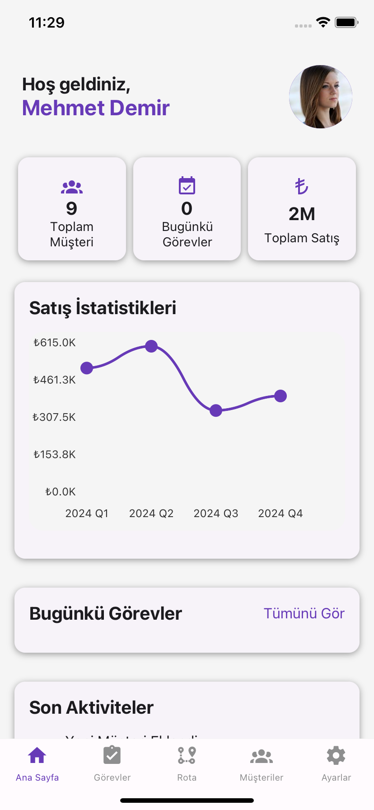
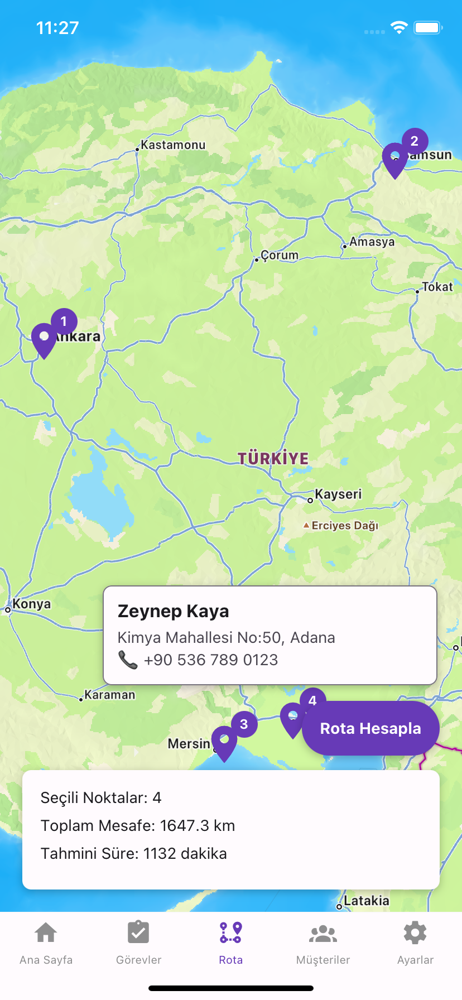
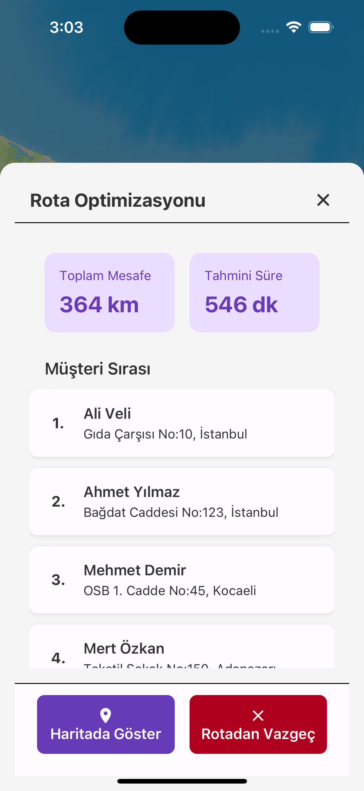
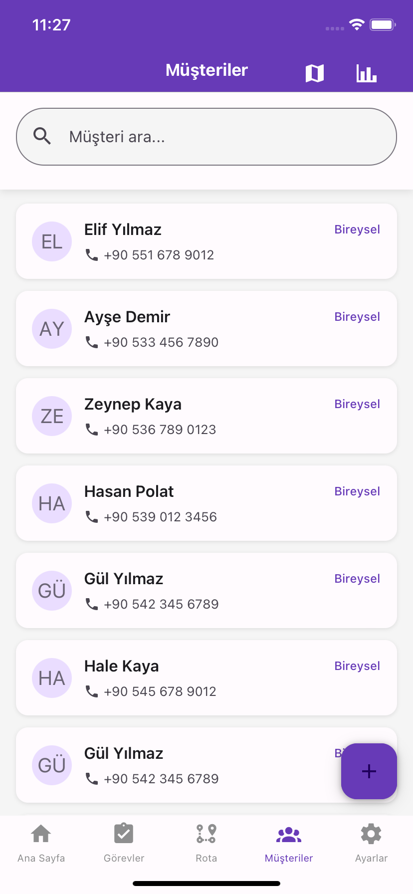
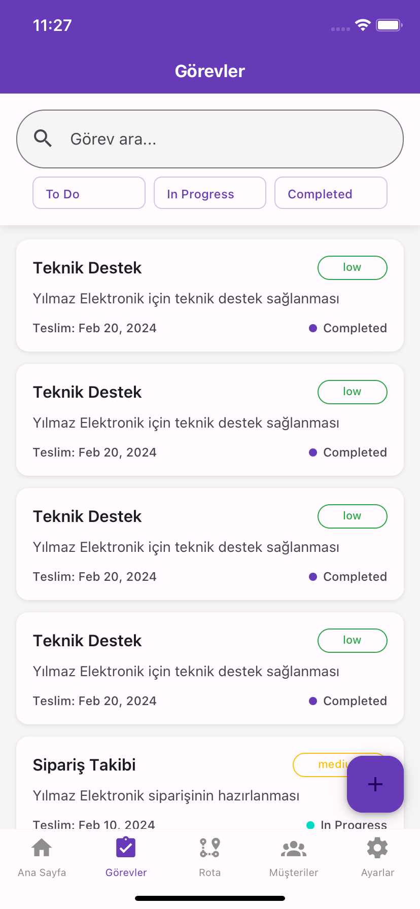

# RouteIQ - Route Optimization Application 🚀

[🇹🇷 Türkçe](#türkçe) | [🇬🇧 English](#english)

## 🇹🇷 Türkçe

### 🌟 Proje Genel Bakış

<p align="center">
  
</p>

#### 📝 Proje Açıklaması

RouteIQ, işletmelerin ve saha çalışanlarının rota optimizasyonunu akıllıca yönetmesine olanak sağlayan gelişmiş bir mobil uygulamadır. Yapay zeka destekli algoritmaları kullanarak, müşteri ziyaretlerini, trafik koşullarını ve hava durumunu hesaba katarak en verimli rotaları belirler.

#### ✨ Temel Özellikler

| 🗺️ Rota Optimizasyonu | 📍 Konum Yönetimi | 📊 Analiz |
|----------------------|-------------------|-----------|
| Gerçek zamanlı rota hesaplama | GPS tabanlı müşteri konumlandırma | Performans raporları |
| Yapay zeka destekli önceliklendirme | Harita üzerinde interaktif marker | Maliyet analizi |
| Çoklu parametre optimizasyonu | Detaylı müşteri bilgileri | Zaman tasarrufu hesaplamaları |

#### 🔍 Detaylı Özellikler ve Açıklamalar

#### 🗺️ Rota Optimizasyon Sistemi
- **Gerçek Zamanlı Rota Hesaplama**: Anlık olarak en kısa ve en verimli rotaları hesaplar
- **Yapay Zeka Destekli Önceliklendirme**: Müşteri önem derecesine, ziyaret sıklığına ve aciliyetine göre rota sıralaması
- **Çoklu Parametre Optimizasyonu**: Mesafe, trafik, hava durumu gibi faktörleri hesaba katar

#### 📍 Konum ve Müşteri Yönetimi
- **GPS Entegrasyonu**: Kesin ve doğru müşteri konumlandırma
- **Harita Üzerinde Etkileşimli Marker'lar**: Müşterileri kolayca seçme ve görüntüleme
- **Detaylı Müşteri Profilleri**: İletişim bilgileri, geçmiş ziyaretler, notlar

#### 📊 Analiz ve Raporlama
- **Performans İstatistikleri**: Ziyaret süreleri, rota verimliliği raporları
- **Maliyet Analizi**: Yakıt tüketimi, zaman tasarrufu hesaplamaları
- **Görsel Raporlama**: Grafikler ve detaylı istatistikler

#### 🖼️ Ekran Görüntüleri

<p align="center">
  
  
  
  
  
</p>

### 🛠️ Teknolojiler

<p align="center">
  
  
  
</p>

- 📱 React Native
- 🔤 TypeScript
- 🗺️ React Native Maps
- 🔐 Firebase Authentication
- 🧩 Redux Toolkit

### 🚀 Hızlı Başlangıç

#### Gereksinimler
- 🟢 Node.js (v16+)
- 📦 Yarn veya npm
- 🍎 Xcode (iOS)
- 🤖 Android Studio (Android)

#### Kurulum Adımları

```bash
# Depoyu klonlama
git clone https://github.com/kullaniciadi/RouteIQ.git
cd RouteIQ

# Bağımlılıkları yükleme
yarn install

# iOS bağımlılıkları
cd ios && pod install && cd ..

# Uygulamayı çalıştırma
yarn ios  # veya yarn android
```

### 🚀 Gelecek Özellikler ve Geliştirme Planı

#### 🤖 Yapay Zeka ve Makine Öğrenmesi
- **Tahmine Dayalı Rota Optimizasyonu**: Geçmiş verilerden öğrenerek en optimal rotaları tahmin etme
- **Müşteri Davranış Analizi**: Müşteri ziyaret desenlerini ve tercihlerini anlama
- **Otomatik Öneri Sistemi**: Ziyaret sırası ve zamanlaması için akıllı öneriler

#### 🌐 Entegrasyon ve Genişletme
- **CRM Sistemleri Entegrasyonu**: Salesforce, HubSpot gibi sistemlerle uyumluluk
- **Bulut Senkronizasyonu**: Gerçek zamanlı veri paylaşımı ve yedekleme
- **Çoklu Kullanıcı ve Rol Yönetimi**: Farklı yetki seviyelerinde kullanıcı hesapları

#### 📱 Mobil ve Kullanıcı Deneyimi
- **Offline Mod Geliştirmeleri**: İnternet bağlantısı olmadan da çalışabilme
- **Gelişmiş Bildirim Sistemi**: Rota değişiklikleri, acil durumlar için bilgilendirmeler
- **Özelleştirilebilir Arayüz**: Kullanıcı tercihlerine göre tema ve düzen ayarları

#### 🔒 Güvenlik ve Performans
- **Gelişmiş Veri Şifreleme**: Müşteri bilgilerinin güvenliği için artırılmış koruma
- **Performans İyileştirmeleri**: Uygulama hızı ve kaynak kullanımının optimize edilmesi
- **Düzenli Güvenlik Güncellemeleri**

### 🌈 Vizyonumuz
RouteIQ olarak amacımız, sahada çalışan profesyonellerin iş verimliliğini artırmak ve müşteri memnuniyetini en üst seviyeye çıkarmaktır. Sürekli öğrenen, uyarlanan ve gelişen bir çözüm sunmayı hedefliyoruz.

### 🤝 Topluluk ve Katkı
Kullanıcılarımızın ve geliştiricilerin geri bildirimleri bizim için çok değerli. Özellik önerileri, hata bildirimleri ve katkılar için her zaman açığız!

### 🤝 Katkıda Bulunma

Katkılarınızı bekliyoruz! Lütfen:
1. Fork yapın
2. Yeni bir branch oluşturun
3. Değişikliklerinizi commit edin
4. Pull request gönderin

### 📄 Lisans

MIT Lisansı altında dağıtılmaktadır.

---

## 🇬🇧 English

### 🌟 Project Overview

<p align="center">
  
</p>

#### 📝 Project Description

RouteIQ is an advanced mobile application that enables businesses and field workers to intelligently manage route optimization. Using AI-powered algorithms, it determines the most efficient routes by considering customer visits, traffic conditions, and weather.

#### ✨ Key Features

| 🗺️ Route Optimization | 📍 Location Management | 📊 Analytics |
|----------------------|----------------------|-------------|
| Real-time route calculation | GPS-based customer positioning | Performance reports |
| AI-powered prioritization | Interactive map markers | Cost analysis |
| Multi-parameter optimization | Detailed customer information | Time-saving calculations |

#### 🔍 Detailed Features and Descriptions

#### 🗺️ Route Optimization System
- **Real-time Route Calculation**: Calculates the shortest and most efficient routes instantly
- **AI-powered Prioritization**: Prioritizes routes based on customer importance, visit frequency, and urgency
- **Multi-parameter Optimization**: Takes into account factors such as distance, traffic, and weather

#### 📍 Location and Customer Management
- **GPS Integration**: Accurate and precise customer positioning
- **Interactive Map Markers**: Easily select and view customers on the map
- **Detailed Customer Profiles**: Contact information, past visits, notes

#### 📊 Analytics and Reporting
- **Performance Statistics**: Visit duration, route efficiency reports
- **Cost Analysis**: Fuel consumption, time-saving calculations
- **Visual Reporting**: Graphs and detailed statistics

#### 🖼️ Screenshots

<p align="center">
  
  
  
  
  
</p>

### 🛠️ Technologies

<p align="center">
  
  
  
</p>

- 📱 React Native
- 🔤 TypeScript
- 🗺️ React Native Maps
- 🔐 Firebase Authentication
- 🧩 Redux Toolkit

### 🚀 Quick Start

#### Requirements
- 🟢 Node.js (v16+)
- 📦 Yarn or npm
- 🍎 Xcode (iOS)
- 🤖 Android Studio (Android)

#### Installation Steps

```bash
# Clone repository
git clone https://github.com/username/RouteIQ.git
cd RouteIQ

# Install dependencies
yarn install

# iOS dependencies
cd ios && pod install && cd ..

# Run application
yarn ios  # or yarn android
```

### 🚀 Future Features and Development Plan

#### 🤖 Artificial Intelligence and Machine Learning
- **Predictive Route Optimization**: Learn from past data to predict the most optimal routes
- **Customer Behavior Analysis**: Understand customer visit patterns and preferences
- **Automatic Suggestion System**: Provide intelligent suggestions for visit order and timing

#### 🌐 Integration and Expansion
- **CRM System Integration**: Compatibility with systems like Salesforce and HubSpot
- **Cloud Synchronization**: Real-time data sharing and backup
- **Multi-user and Role Management**: User accounts with different permission levels

#### 📱 Mobile and User Experience
- **Offline Mode Improvements**: Functionality without internet connection
- **Advanced Notification System**: Notifications for route changes and emergencies
- **Customizable Interface**: Theme and layout adjustments based on user preferences

#### 🔒 Security and Performance
- **Advanced Data Encryption**: Enhanced protection for customer information
- **Performance Improvements**: Optimized application speed and resource usage
- **Regular Security Updates**

### 🌈 Our Vision
At RouteIQ, our goal is to increase the productivity of field professionals and maximize customer satisfaction. We aim to provide a continuously learning, adapting, and improving solution.

### 🤝 Community and Contribution
We value feedback from our users and developers. Feature suggestions, bug reports, and contributions are always welcome!

### 🤝 Contributing

We welcome contributions! Please:
1. Fork the project
2. Create a new branch
3. Commit your changes
4. Submit a pull request

### 📄 License

Distributed under the MIT License.

---

**Contact:** Turgay Kırkıl - turgaykirkil@email.com
**Project Link:** [RouteIQ GitHub Repository](https://github.com/username/RouteIQ)
